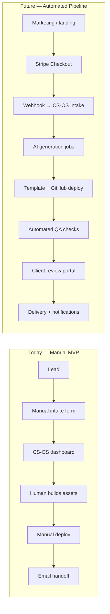
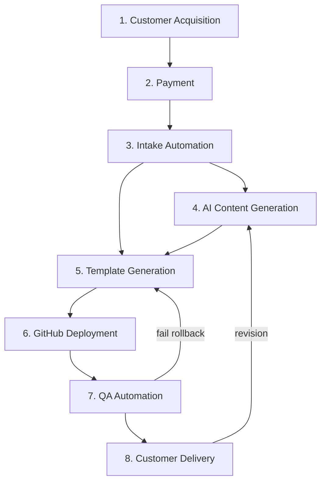

# CS-OS Automation Architecture Plan

**Status:** Design document — no implementation  
**Scope:** Future fully automated service pipeline  
**Constraint:** Current MVP application remains unchanged until Phase 4+ execution

---

## Purpose

This document defines how Career Systems OS evolves from a **manual-first internal workflow system** (current state) into a **fully automated career delivery pipeline** capable of acquiring customers, collecting payment, generating assets, deploying portfolios, and handing off deliverables with minimal human intervention.

Every automation must map to a step already performed manually in Phase 1–3 validation. No speculative features.

---

## Guiding Principles

1. **Automate proven steps only** — if it is not in the SOP, it is not automated yet.
2. **Human gates at QA and Review** until error rates are measured and acceptable.
3. **CS-OS remains the system of record** — external tools emit events; CS-OS logs state.
4. **Package-tier gating** — Basic / Standard / Premium control which automations run.
5. **Fail closed** — payment, intake validation, or deploy failure blocks pipeline advance.

---

## System Context (Current vs Future)



---

## Pipeline Stage Mapping

| CS-OS Stage | Automation Domains |
|-------------|-------------------|
| Intake | Customer acquisition, payment, intake automation |
| Analysis | AI content planning, template selection |
| Build | AI generation, template generation, GitHub deploy |
| QA | QA automation |
| Review | Customer delivery (partial — client feedback loop) |
| Delivered | Customer delivery automation (handoff, DNS, notifications) |

---

## 1. Customer Acquisition Flow

### Current manual process

- Outreach via personal network, campus groups, LinkedIn DMs, referrals
- Prospect receives informal explanation of Basic / Standard / Premium tiers
- Lead tracked informally (spreadsheet, DMs) or not at all until intake
- No centralized landing page or CRM lead object in CS-OS
- Conversion to client happens when operator submits `/intake` manually

### Future automated process

1. Prospect lands on **marketing site** with tier comparison and social proof
2. CTA routes to **Stripe Checkout** (tier pre-selected) or **lead capture form** for nurture
3. Optional: low-friction **waitlist / quiz** → email sequence (3 emails: problem, proof, offer)
4. On payment success (or qualified lead), **webhook creates CS-OS Client + Project** at Intake
5. Lead source, UTM, and package tier stored on client record
6. Dashboard shows lead → paid client conversion metrics from timestamp logs

### Required technology

| Component | Options |
|-----------|---------|
| Landing / marketing | Static site (Render, GitHub Pages) or Next.js on Render |
| Lead capture | Tally, Typeform, or embedded FastAPI public form |
| Email nurture | Resend, Mailgun, or ConvertKit |
| Analytics | Plausible / PostHog for funnel events |
| CS-OS integration | Webhook endpoint (future) → create Client |

### Dependencies

- Payment integration (Section 2) for paid acquisition path
- Intake automation (Section 3) for post-conversion record creation
- Public-facing domain and privacy policy / terms

### Risks

| Risk | Mitigation |
|------|------------|
| Low-quality leads fill pipeline | Qualifying questions in checkout metadata; tier minimums |
| No attribution data | Require UTM passthrough to Stripe metadata |
| Over-automation before offer is proven | Keep manual outreach parallel until 10+ paid clients |
| Spam / bot submissions | CAPTCHA on public forms; rate limiting |

---

## 2. Payment Integration Points

### Current manual process

- Payment handled outside CS-OS (Venmo, PayPal, Stripe Payment Link manually sent)
- Package tier selected verbally or via DM; operator sets tier on intake form
- No payment status field in CS-OS; trust-based start of work
- Refunds and disputes handled manually with no system link

### Future automated process

1. **Stripe Checkout Session** created per tier (Basic $99, Standard $199, Premium $299–399)
2. Customer pays → **`checkout.session.completed` webhook** fires
3. Webhook handler validates signature, idempotency key, and tier metadata
4. CS-OS creates Client with `package_tier`, `payment_status=paid`, `stripe_customer_id`, `stripe_session_id`
5. Project auto-created at **Intake**; timestamp log records `payment_received`
6. Failed / abandoned checkout → optional recovery email (Stripe + Resend)
7. Refunds → `charge.refunded` webhook sets `payment_status=refunded`; blocks pipeline advance

### Required technology

| Component | Purpose |
|-----------|---------|
| Stripe Checkout | Hosted payment, PCI scope reduction |
| Stripe Webhooks | Event-driven CS-OS updates |
| Stripe Customer Portal | Self-service receipt / upgrade (later) |
| Secrets management | Render env vars or Stripe-restricted keys |

### Integration points (CS-OS)

```
[Stripe Checkout] --webhook--> [POST /webhooks/stripe] --writes--> [Client, Project, TimestampLog]
                                      |
                                      v
                               [Intake automation trigger]
```

### Dependencies

- Public HTTPS endpoint for webhooks (Render web service)
- Customer acquisition landing with tier CTAs
- Intake automation to consume payment event payload
- Legal: refund policy, terms of service

### Risks

| Risk | Mitigation |
|------|------------|
| Webhook replay / fraud | Stripe signature verification; idempotency store |
| Paid but incomplete intake | Hold at Intake until structured intake submitted |
| Tier mismatch | Encode `package_tier` in Checkout Session metadata only |
| Chargebacks | Delay auto-deploy until QA pass; clear deliverable scope in ToS |

---

## 3. Intake Automation

### Current manual process

- Operator opens `/intake` in CS-OS
- Client fills structured fields: name, target role, education / projects / work, skills, links
- `intake_validation.py` normalizes and rejects vague data
- `create_client_with_project()` seeds project, tasks, deliverables
- Manual copy-paste if client sends info via email/DM instead of form

### Future automated process

1. **Post-payment redirect** → hosted intake form (prefilled: email, tier from Stripe)
2. Client submits → same validation rules as today, enforced server-side
3. Optional: **LinkedIn / GitHub URL fetch** (read-only) to pre-populate draft — client confirms before submit
4. On valid submit → CS-OS record updated; project advances to **Analysis** automatically (or queues for operator approval toggle)
5. Confirmation email with intake summary PDF / link
6. Timestamp log: `intake_submitted`, field checksum for audit

### Required technology

| Component | Purpose |
|-----------|---------|
| Public intake API or form | Separate route from internal dashboard |
| Stripe customer email | Prefill identity |
| Optional scrapers | GitHub public API, LinkedIn (limited — see risks) |
| Email | Confirmation via Resend |
| Job queue | Celery / Redis or Render background worker for async enrichment |

### Dependencies

- Payment webhook (client record must exist)
- Same schema as current `experience_summary` composition (education / projects / work → stored block)
- CS-OS `can_transition` rules respected on auto-advance

### Risks

| Risk | Mitigation |
|------|------------|
| Client submits garbage after paying | Validation unchanged; refund policy; manual review flag |
| LinkedIn ToS / scraping blocks | Manual paste fallback; never require scrape |
| Duplicate submissions | Idempotency on `stripe_session_id` |
| PII exposure on public form | HTTPS, minimal retention, no public client IDs in URLs |

---

## 4. AI Content Generation Pipeline

### Current manual process

- Operator reads intake data in CS-OS client detail
- Manual prompt library (external: ChatGPT / Cursor) for resume bullets, portfolio copy, LinkedIn headline
- Copy-paste outputs into template files and Google Docs
- Narrative alignment done by eye across resume, site, and LinkedIn notes
- Premium tier: 30-min strategy call — entirely human

### Future automated process

1. **Analysis stage complete** → trigger `content_generation` job with structured intake JSON
2. **Prompt orchestration layer** selects prompts by tier and `target_role` category
3. Parallel generation jobs:
   - Resume sections (impact-formula bullets)
   - Portfolio copy blocks (hero, about, projects, contact)
   - LinkedIn headline + about + featured bullets (Standard+)
   - Career narrative summary (Premium)
4. Outputs stored as **versioned artifacts** linked to Deliverables (not overwriting silently)
5. Operator review queue (optional gate) before Build auto-fill
6. Regeneration on revision requests with diff logged in TimestampLog

### Required technology

| Component | Purpose |
|-----------|---------|
| LLM API | OpenAI / Anthropic for structured generation |
| Prompt registry | Versioned YAML or DB table (`prompt_id`, `version`, `tier`) |
| JSON schema validation | Ensure outputs match template slot structure |
| Object storage | S3 / Render disk for artifact versions |
| Job queue | Background workers for parallel generation |

### Data flow

```
[Intake JSON] --> [Prompt selector] --> [LLM calls] --> [Schema validate] --> [Artifact store]
                                                          |
                                                          v
                                              [Deliverable records updated]
```

### Dependencies

- Intake automation (structured source data)
- Template generation system (slot definitions for valid output shape)
- Package tier gates which generators run

### Risks

| Risk | Mitigation |
|------|------------|
| Hallucinated experience | Ground prompts strictly in intake fields; human QA gate |
| Inconsistent tone across assets | Shared `narrative_profile` object generated once, reused |
| API cost overrun | Tier limits on regeneration count; token budgets per job |
| Generic output | Role-specific prompt packs; few-shot examples per template |
| Legal / misrepresentation | Client attestation checkbox on intake; review stage mandatory |

---

## 5. Template Generation System

### Current manual process

- Three templates planned: Minimal, Data/Tech, Professional/Corporate
- Operator manually selects template during Analysis (`Select portfolio template` task)
- Files copied from local starter repos; manual find-replace for name, projects, links
- Resume: separate Word/Google template, manual export to PDF
- No template registry in CS-OS — choice tracked only as task completion

### Future automated process

1. **Template registry** in config or DB: `template_id`, `tier_eligible`, `stack`, `slot_map`
2. Analysis job recommends template from `target_role` + skills keywords (operator can override)
3. **Slot-based merge**: intake + AI artifacts → template variables (`{{hero_title}}`, `{{projects[]}}`)
4. Static site generator (Astro / Next export / Jinja static) produces build artifact
5. Resume branch: LaTeX or DOCX template → PDF via headless renderer
6. Output: git-ready repo structure + PDF in deliverable storage
7. CS-OS Build task auto-marked in progress when generation starts; done on artifact attach

### Required technology

| Component | Purpose |
|-----------|---------|
| Template repo(s) | One repo per template, semver tagged |
| Templating engine | Jinja2, Handlebars, or Astro content collections |
| PDF generation | WeasyPrint, Puppeteer, or docx-templater |
| Template selector | Rule engine or lightweight ML classifier (later) |
| CS-OS metadata | `project.template_id` field (future schema addition) |

### Template slot contract (example)

| Slot | Source |
|------|--------|
| `hero_title` | AI → headline |
| `hero_subtitle` | intake.target_role |
| `projects[]` | intake + AI expanded |
| `skills[]` | intake.skills normalized |
| `github_url` | intake.github_url |
| `resume_pdf` | resume generation pipeline |

### Dependencies

- AI content generation (fill slots)
- GitHub deployment automation (output must be repo-ready)
- Intake normalization (skills, experience blocks)

### Risks

| Risk | Mitigation |
|------|------------|
| Template drift | Semver + locked slot contracts; CI for template repos |
| Wrong template selected | Human override in Analysis; preview before deploy |
| Build failures | Template CI builds on every tag; QA checks links |
| Premium customization breaks automation | Premium flag routes to human Build queue |

---

## 6. GitHub Deployment Automation

### Current manual process

- Operator creates GitHub repo manually (or from template repo "Use this template")
- Pushes generated site files via git CLI
- Enables GitHub Pages or connects to Render/Vercel manually
- Records deployment URL in CS-OS deliverable field by hand
- GitHub profile cleanup (pin repos, bio) — manual checklist item

### Future automated process

1. Build artifact ready → **`deploy_job` creates repo** via GitHub App or PAT with least privilege
2. Repo naming convention: `{client-slug}-portfolio` under org or client account
3. Initial commit pushed; **GitHub Actions** workflow deploys to GitHub Pages or Render
4. Optional: custom domain DNS instructions emailed to client (Premium)
5. Deploy URL written to CS-OS Deliverable `Deployment URL`; status → complete on HTTP 200 check
6. Webhook from GitHub Actions → CS-OS updates task status and timestamp log
7. GitHub profile: generate suggested bio/README; client applies (semi-automated — ToS limits full auto)

### Required technology

| Component | Purpose |
|-----------|---------|
| GitHub App | Repo creation, workflow dispatch (preferred over PAT) |
| GitHub Actions | CI/CD to Pages or artifact deploy |
| Render / Cloudflare Pages | Alternative host if not GitHub Pages |
| DNS API (optional) | Cloudflare for custom domains (Premium) |
| Secrets | GitHub App credentials, deploy tokens in env |

### Deployment flow

```
[Template output] --> [Create repo] --> [Push main] --> [GHA deploy] --> [Health check URL]
                                                              |
                                                              v
                                                    [CS-OS deliverable.url set]
```

### Dependencies

- Template generation system (repo contents)
- QA automation (post-deploy health check)
- Client GitHub username from intake (optional — org-hosted fallback)

### Risks

| Risk | Mitigation |
|------|------------|
| GitHub rate limits / auth expiry | GitHub App with installation tokens; retry queue |
| Client repo permission denied | Default to org-hosted repo; transfer instructions |
| Deploy succeeds, wrong branch | Convention: `main` only; branch protection |
| Exposed secrets in repo | Secret scanning; templated `.env.example` only |
| Abandoned repos | Org retention policy; archive job post-delivery |

---

## 7. QA Automation

### Current manual process

- Operator runs mental checklist at QA stage (`QA checklist` task)
- Manual click-through: all links, mobile view, resume PDF opens, copy proofread
- LinkedIn/GitHub alignment checked by eye
- Pass/fail is subjective; no automated test record
- Rollback to Build (Option B policy) if issues found — manual status change in CS-OS

### Future automated process

1. On deploy complete → **`qa_job` runs automated checklist**:
   - HTTP 200 on portfolio URL
   - Lighthouse performance / accessibility thresholds (configurable minimums)
   - Broken link crawler (internal + GitHub + LinkedIn public URLs)
   - PDF exists and page count > 0
   - Required sections present (DOM selectors or markdown headings)
   - Spellcheck on visible text (dictionary + allowlist for tech terms)
2. QA results stored as structured report linked to project
3. **Pass** → auto-advance to Review (or flag for human sign-off if score borderline)
4. **Fail** → auto-rollback one stage to Build (per Option B policy) with failure reasons logged
5. CS-OS displays QA report summary on client detail (future UI — not MVP)

### Required technology

| Component | Purpose |
|-----------|---------|
| Playwright / Puppeteer | E2E page checks, screenshots |
| Lighthouse CI | Performance, a11y scores |
| linkchecker / custom crawler | Broken links |
| PDF validator | Page count, file size |
| Job queue | Async QA after deploy webhook |

### QA report schema (future)

```json
{
  "project_id": 9,
  "passed": false,
  "checks": [
    {"name": "homepage_200", "passed": true},
    {"name": "lighthouse_performance", "passed": false, "score": 62}
  ],
  "screenshot_urls": []
}
```

### Dependencies

- GitHub deployment automation (URL must exist)
- Template generation (expected DOM structure / selectors per template)
- CS-OS `can_transition` for automated rollback

### Risks

| Risk | Mitigation |
|------|------------|
| False positives block delivery | Borderline scores → human review queue, not auto-rollback |
| False negatives ship bad work | Keep Review stage human until QA accuracy proven |
| Flaky E2E tests | Retry policy; screenshot on failure |
| Lighthouse variance | Thresholds tuned per template; track trends not absolutes |

---

## 8. Customer Delivery Automation

### Current manual process

- Operator emails client with links: portfolio, resume PDF, LinkedIn suggestions doc
- Deployment URL pasted into CS-OS deliverable field
- Client feedback via email/DM; revisions tracked informally
- Review stage: manual status updates, revision count in operator's head
- Delivered: manual "handoff complete" status change; no automated confirmation to client

### Future automated process

1. **Review stage entry** → client receives **delivery portal link** (magic link or email OTP)
2. Portal shows: live portfolio, resume download, LinkedIn copy blocks, revision request form
3. Client submits revision request → CS-OS creates revision task; operator notified
4. Revision count incremented; timestamp log records `revision_requested`
5. On client approval (button: "Approve deliverables") → auto-advance to **Delivered**
6. **Delivered trigger**:
   - Handoff email with all URLs, DNS instructions (if Premium), 30-day support scope
   - Optional: schedule Premium strategy call via Cal.com webhook
   - Slack/email notification to operator: delivery complete
   - CS-OS metrics: time-to-deliver computed from intake timestamp
7. Post-delivery: satisfaction survey (1–5) linked to client record

### Required technology

| Component | Purpose |
|-----------|---------|
| Client portal | Lightweight authenticated pages (magic link JWT) |
| Email | Resend / SendGrid for transactional delivery |
| Cal.com / Calendly | Premium strategy session booking |
| Notification | Slack webhook for operator alerts |
| Survey | Tally or embedded 1-question form |

### Delivery package by tier

| Asset | Basic | Standard | Premium |
|-------|-------|----------|---------|
| Portfolio URL | ✓ | ✓ | ✓ |
| Resume PDF | — | ✓ | ✓ |
| LinkedIn copy | — | ✓ | ✓ |
| Strategy call link | — | — | ✓ |
| Custom domain guide | — | — | ✓ |

### Dependencies

- QA automation pass (nothing delivered before QA)
- AI content + template + deploy pipelines (assets must exist)
- Payment status = paid (no delivery on refunded clients)

### Risks

| Risk | Mitigation |
|------|------------|
| Client never approves | SLA reminder emails; operator override to Delivered with log |
| Revision scope creep | Tier-based revision limits in ToS; CS-OS revision counter |
| Magic link leakage | Short TTL; one-time tokens |
| Incomplete deliverables auto-sent | Gate delivery email on all required deliverables `complete` |

---

## Cross-Stage Dependency Graph



**Critical path:** Payment → Intake → AI + Template → Deploy → QA → Delivery

---

## Technology Stack Summary (Future State)

| Layer | Technology | Phase |
|-------|------------|-------|
| System of record | CS-OS (FastAPI + Postgres) | Phase 3–4 |
| Payments | Stripe Checkout + Webhooks | Phase 4 |
| AI | OpenAI / Anthropic API + prompt registry | Phase 4 |
| Templates | Astro/Jinja repos + semver | Phase 4 |
| Deploy | GitHub App + Actions + Pages/Render | Phase 4 |
| QA | Playwright + Lighthouse CI | Phase 4+ |
| Email | Resend | Phase 4 |
| Queue | Redis + background worker (Render) | Phase 4 |
| Client portal | FastAPI public routes + JWT magic links | Phase 4+ |

**Database migration note:** SQLite MVP → PostgreSQL required before multi-worker automation (Render Postgres).

---

## Phased Rollout (Recommended)

| Phase | Automation scope | Human role |
|-------|------------------|------------|
| **Now (MVP)** | None — CS-OS tracking only | 100% manual delivery |
| **4a** | Stripe + intake webhook + email confirmations | Build, QA, delivery manual |
| **4b** | AI draft generation + template merge | Human edits all outputs |
| **4c** | GitHub deploy automation | Human QA review |
| **4d** | Automated QA checks | Human Review + Delivered approval |
| **4e** | Client portal + delivery emails | Operator handles exceptions only |
| **5** | Full pipeline unattended for Basic tier | Human Premium + exceptions |

---

## What Stays Unchanged (Current Application)

Until explicit Phase 4 implementation begins:

- No new routes, webhooks, or workers in CS-OS repo
- Pipeline rules: `can_transition`, Option B rollback — unchanged
- Manual intake form at `/intake` — unchanged
- Single-user, no auth — unchanged
- Demo seed and sales docs — unchanged

This document is the **blueprint only**. Implementation tickets should reference section numbers and depend on Phase 1–3 SOP validation metrics (time per client, revision count, failure modes).

---

## Open Decisions (Resolve Before Build)

| # | Decision | Options |
|---|----------|---------|
| 1 | Auto-advance after intake? | Yes / operator toggle / no |
| 2 | Org repo vs client repo default? | Org-hosted recommended |
| 3 | Basic tier fully unattended? | Only after 20+ unattended successes |
| 4 | LinkedIn data source | Manual paste only vs API (likely manual) |
| 5 | Postgres migration timing | Before any webhook or worker |

---

## Related Documents

- [EXECUTION.md](../EXECUTION.md) — Business plan and MVP scope lock
- [DEMO_MODE.md](./DEMO_MODE.md) — Sales demo environment
- [DEMO_WALKTHROUGH.md](./DEMO_WALKTHROUGH.md) — Customer journey script
- [README.md](../README.md) — Developer quick start

---

## Document Control

| Field | Value |
|-------|-------|
| Version | 1.0 |
| Type | Architecture plan (non-binding until phased approval) |
| Code impact | None |
