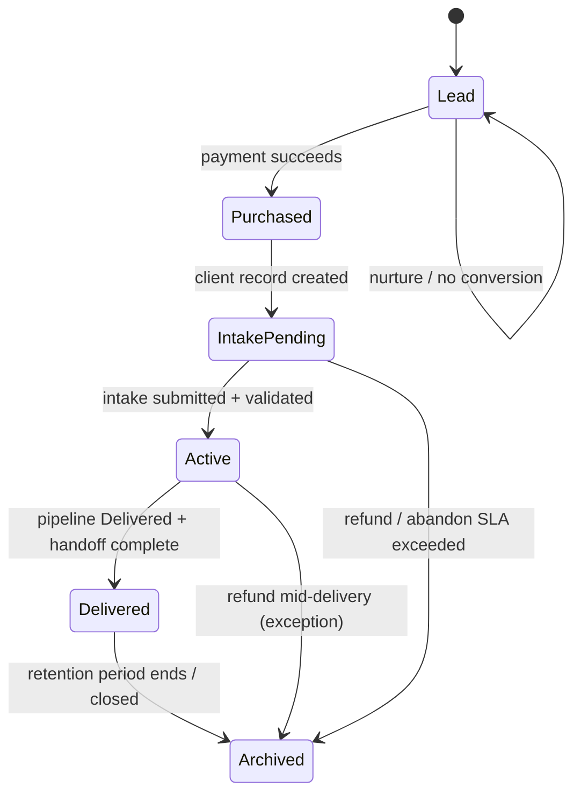
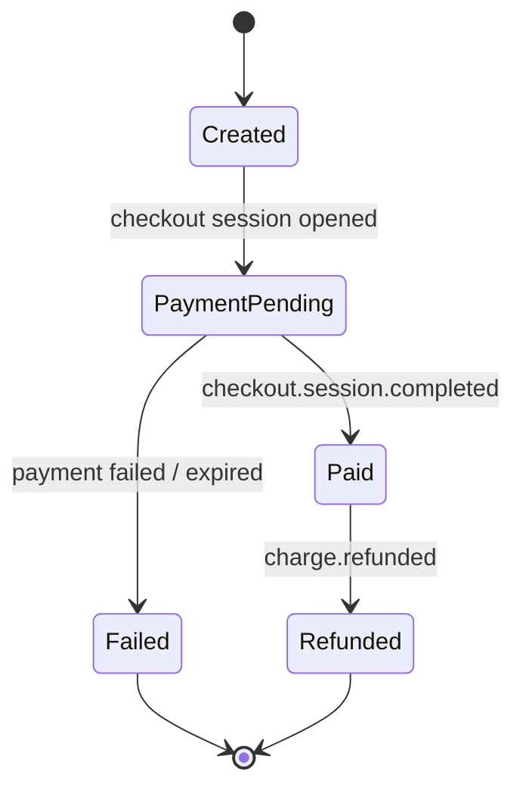
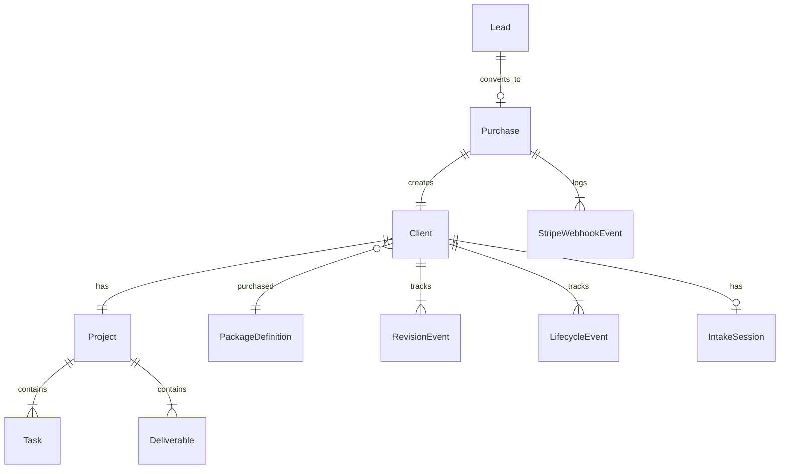

# CS-OS Paid Client Operations Layer

**Status:** Plan + data model proposal — no application code  
**Goal:** Prepare CS-OS for real paying customers before Stripe integration  
**Constraint:** Existing delivery pipeline (`Intake → Analysis → Build → QA → Review → Delivered`) and workflow rules remain **unchanged**

---

## Purpose

This document defines the **commercial operations layer** that sits alongside the existing **delivery pipeline**. The pipeline tracks *how work moves*. The operations layer tracks *who paid, what they bought, what they're owed, and whether SLA is met*.

Two orthogonal state machines:

| Layer | Question it answers |
|-------|---------------------|
| **Customer lifecycle** | Where is this person in the commercial relationship? |
| **Delivery pipeline** | Where is this project in fulfillment? (existing CS-OS) |
| **Purchase lifecycle** | What is the status of the payment transaction? |

---

## 1. Customer Lifecycle

### 1.1 States

```text
Lead → Purchased → Intake Pending → Active → Delivered → Archived
```



### 1.2 State definitions

| State | Slug | Entry condition | Exit condition |
|-------|------|-----------------|----------------|
| **Lead** | `lead` | Marketing touch, waitlist, or checkout started | Payment succeeds OR disqualified |
| **Purchased** | `purchased` | `Purchase.status = paid`; client stub may exist | Intake link issued |
| **Intake Pending** | `intake_pending` | Paid client; `intake_status != complete` | Valid intake submitted |
| **Active** | `active` | Intake complete; pipeline work in progress | Pipeline reaches Delivered + ops sign-off |
| **Delivered** | `delivered` | All package deliverables complete; handoff sent | Archive policy triggers |
| **Archived** | `archived` | Manual or automatic close | Terminal state |

### 1.3 Mapping to existing delivery pipeline

Customer lifecycle **does not replace** pipeline stages. Mapping at key points:

| Customer lifecycle | Typical pipeline stage | Notes |
|--------------------|------------------------|-------|
| Lead | — | No project yet |
| Purchased | — | Payment only; provisioning |
| Intake Pending | **Intake** | Project exists; placeholder data |
| Active | **Analysis → Review** | Fulfillment in progress |
| Delivered | **Delivered** | Both layers aligned |
| Archived | **Delivered** (frozen) | Read-only; no stage changes |

**Rule:** Pipeline `can_transition` rules are unchanged. Customer lifecycle is updated by separate ops events (payment webhook, intake submit, handoff confirm, archive job).

### 1.4 Manual vs paid clients

| Source | Initial lifecycle | Payment record |
|--------|-------------------|----------------|
| Stripe checkout | Lead → Purchased → Intake Pending | Required |
| Operator `/intake` | **Active** (skip payment states) | Optional `Purchase` with `manual_comp` |
| Demo `[DEMO]` seed | Active or Delivered | None |

---

## 2. Purchase Lifecycle

### 2.1 States

```text
Created → Payment Pending → Paid | Failed | Refunded
```



### 2.2 State definitions

| State | Slug | Trigger | CS-OS action |
|-------|------|---------|--------------|
| **Created** | `created` | Checkout Session API call | Store session ID; no client yet (optional) |
| **Payment Pending** | `payment_pending` | Customer on Stripe Checkout page | None; wait |
| **Paid** | `paid` | Webhook `checkout.session.completed` | Create client + project; issue intake link |
| **Failed** | `failed` | `payment_intent.payment_failed` or session expired | Log; no client; optional recovery |
| **Refunded** | `refunded` | `charge.refunded` | Invalidate intake; block pipeline; log |

### 2.3 Purchase ↔ Client relationship

- One **Purchase** maps to exactly one **Client** after `paid` (1:1)
- Duplicate webhook / session → idempotent; one Purchase, one Client
- Customer may have multiple Purchases over time (upgrade, new engagement) → new Client or linked via `stripe_customer_id` (future decision)

---

## 3. Client SLA

Operational law for paid customers. Display in checkout confirmation and intake email.

### 3.1 Package delivery times (business days)

Clock starts at **Intake Pending → Active** (validated intake submitted), not payment date.

| Package | Target delivery | Maximum delivery | Clock pause |
|---------|-----------------|------------------|-------------|
| Foundation | 5 business days | 10 business days | Awaiting client revision feedback |
| Launch | 7 business days | 14 business days | Same |
| Accelerator | 10 business days | 21 business days | Same + strategy session scheduling |

**Payment-to-intake window (separate SLA):**

| Milestone | Deadline | Action if missed |
|-----------|----------|------------------|
| Intake submission after payment | 7 calendar days | Reminder at 24h, 72h, day 7 |
| Intake not submitted by day 14 | — | Operator contact; optional refund minus fee (policy) |

### 3.2 Revision limits

| Package | Included revision rounds | Scope per round | Overages |
|---------|-------------------------|-----------------|----------|
| Foundation | 1 | Portfolio copy/layout only | Quoted separately |
| Launch | 2 | Portfolio + resume + LinkedIn copy | Quoted separately |
| Accelerator | 3 | All included deliverables + narrative doc | 1 extra round: $49 (configurable) |

**Revision rules:**

- One "round" = one consolidated client feedback submission
- Scope creep (new projects, role change) → new purchase or upgrade, not a revision
- Operator records round in `revision_events` table (future); increments `revision_count`

### 3.3 Customer responsibilities

Customer must provide **before intake deadline**:

| Responsibility | Required |
|----------------|----------|
| Accurate career information (education, projects, work) | ✓ |
| Valid email access (for intake link + delivery) | ✓ |
| GitHub URL (public repos or access instructions) | ✓ Foundation+ |
| LinkedIn URL | ✓ Launch+ |
| Target role stated explicitly | ✓ |
| Response to review feedback within 5 business days | ✓ |
| Attend strategy session (Accelerator) | ✓ within 14 days of scheduling offer |

**Customer attestation (intake checkbox, future):**

> I confirm the experience and projects listed are accurate and mine to represent.

**Grounds to pause SLA clock:**

- Client unresponsive > 5 business days at Review
- Client requests hold (documented in ops notes)

---

## 4. Package Rules

Canonical reference: [PRICING_MODEL.md](./PRICING_MODEL.md). Summary for operations layer.

### 4.1 Foundation (`foundation`)

**Included deliverables**

| Deliverable key | Display name |
|-----------------|--------------|
| `portfolio_website` | Portfolio website |
| `deployment_url` | Deployment URL |
| `github_guidance` | GitHub profile guidance (document) |

**Excluded deliverables**

- `resume_pdf`
- `linkedin_optimization_notes`
- `career_narrative_summary`
- `strategy_session`
- `custom_domain_guide`

**Fulfillment tasks (pipeline)**

| Task | Included |
|------|----------|
| Review intake data | ✓ |
| Audit LinkedIn profile | ○ light |
| Audit GitHub profile | ✓ |
| Select portfolio template | ✓ |
| Build portfolio site | ✓ |
| Resume rewrite | ✗ |
| QA checklist | ✓ |
| Client review + revisions | ✓ (1 round) |
| Deploy + handoff | ✓ |

---

### 4.2 Launch (`launch`)

**Included deliverables**

- All Foundation deliverables
- `resume_pdf` — Resume (PDF)
- `linkedin_optimization_notes` — LinkedIn optimization notes

**Excluded deliverables**

- `career_narrative_summary`
- `strategy_session`
- `custom_domain_guide`

**Fulfillment tasks**

| Task | Included |
|------|----------|
| All Foundation tasks (full LinkedIn audit) | ✓ |
| Resume rewrite | ✓ |
| Client review + revisions | ✓ (2 rounds) |

---

### 4.3 Accelerator (`accelerator`)

**Included deliverables**

- All Launch deliverables
- `career_narrative_summary` — Career narrative summary (1-page)
- `strategy_session` — 30-min strategy session
- `custom_domain_guide` — Custom domain setup guide

**Excluded deliverables**

- None within standard scope
- Custom design from scratch, ongoing retainers, job application submission → excluded (add-ons)

**Fulfillment tasks**

| Task | Included |
|------|----------|
| All Launch tasks | ✓ |
| Career narrative alignment (internal) | ✓ |
| Strategy session + prep | ✓ |
| Client review + revisions | ✓ (3 rounds) |

### 4.4 Package enforcement (future behavior)

When ops layer is implemented:

- Seed only **included** deliverables per `package_slug`
- Mark excluded tasks as `not_applicable` (not `todo`)
- Block Delivered customer lifecycle until all **included** deliverables = `complete`
- Dashboard filter: `package_slug` + `customer_lifecycle` + pipeline stage

**Current MVP:** All four deliverables seeded for all clients — enforcement deferred until migration.

---

## 5. Data Model Proposal

Entities required **before** Stripe integration. Existing entities (`Client`, `Project`, `Task`, `Deliverable`, `TimestampLog`) remain; pipeline unchanged.

### 5.1 Entity relationship overview



### 5.2 New entities

#### `leads` (optional Phase 4a; recommended Phase 4a+)

Pre-payment prospects.

| Column | Type | Notes |
|--------|------|-------|
| `id` | PK | |
| `email` | VARCHAR(320) | INDEX |
| `source` | VARCHAR(100) | utm, referral, waitlist |
| `package_interest` | VARCHAR(50) | nullable slug |
| `lifecycle_state` | ENUM | default `lead` |
| `created_at` | TIMESTAMPTZ | |
| `converted_at` | TIMESTAMPTZ | nullable |

#### `purchases`

Payment transaction record — **create before Stripe**.

| Column | Type | Notes |
|--------|------|-------|
| `id` | PK | |
| `public_id` | UUID | UNIQUE; customer-facing order ref |
| `lead_id` | FK | nullable |
| `client_id` | FK | nullable until paid |
| `package_slug` | VARCHAR(50) | foundation / launch / accelerator |
| `status` | ENUM | created, payment_pending, paid, failed, refunded |
| `amount_cents` | INTEGER | snapshot at purchase time |
| `currency` | CHAR(3) | default USD |
| `stripe_checkout_session_id` | VARCHAR(255) | UNIQUE |
| `stripe_payment_intent_id` | VARCHAR(255) | UNIQUE nullable |
| `stripe_customer_id` | VARCHAR(255) | nullable INDEX |
| `paid_at` | TIMESTAMPTZ | nullable |
| `failed_at` | TIMESTAMPTZ | nullable |
| `refunded_at` | TIMESTAMPTZ | nullable |
| `created_at` | TIMESTAMPTZ | |
| `updated_at` | TIMESTAMPTZ | |

#### `package_definitions`

Config-backed or DB-seeded reference (read-only at runtime).

| Column | Type | Notes |
|--------|------|-------|
| `slug` | PK | foundation, launch, accelerator |
| `display_name` | VARCHAR(100) | |
| `revision_limit` | INTEGER | |
| `delivery_target_days` | INTEGER | business days |
| `delivery_max_days` | INTEGER | |
| `included_deliverables` | JSON | array of deliverable keys |
| `included_tasks` | JSON | array of task keys |
| `active` | BOOLEAN | |

*Alternative:* Load from `packages.config.yaml` only — no DB table until needed for admin UI.

#### `intake_sessions`

Handoff token + status (may merge into Client per Phase 4a plan).

| Column | Type | Notes |
|--------|------|-------|
| `id` | PK | |
| `client_id` | FK | UNIQUE |
| `token_hash` | VARCHAR(128) | store hash, not plaintext |
| `expires_at` | TIMESTAMPTZ | |
| `status` | ENUM | pending, complete, expired, revoked |
| `completed_at` | TIMESTAMPTZ | nullable |
| `created_at` | TIMESTAMPTZ | |

#### `lifecycle_events`

Customer lifecycle audit trail (parallel to TimestampLog for pipeline).

| Column | Type | Notes |
|--------|------|-------|
| `id` | PK | |
| `client_id` | FK | INDEX |
| `previous_state` | VARCHAR(50) | nullable |
| `new_state` | VARCHAR(50) | |
| `trigger` | VARCHAR(100) | webhook, intake_submit, handoff, archive |
| `created_at` | TIMESTAMPTZ | |

#### `revision_events`

SLA revision tracking.

| Column | Type | Notes |
|--------|------|-------|
| `id` | PK | |
| `client_id` | FK | INDEX |
| `project_id` | FK | |
| `round_number` | INTEGER | |
| `scope` | TEXT | client feedback summary |
| `created_at` | TIMESTAMPTZ | |

#### `stripe_webhook_events`

Idempotency + debug (from Phase 4a plan).

| Column | Type | Notes |
|--------|------|-------|
| `id` | PK | |
| `stripe_event_id` | VARCHAR(255) | UNIQUE |
| `event_type` | VARCHAR(100) | |
| `purchase_id` | FK | nullable |
| `processing_status` | ENUM | processed, ignored, error |
| `processing_error` | TEXT | nullable |
| `created_at` | TIMESTAMPTZ | |

### 5.3 Extensions to existing `clients`

| Column | Type | Notes |
|--------|------|-------|
| `public_id` | UUID | UNIQUE |
| `email` | VARCHAR(320) | INDEX; nullable for legacy |
| `customer_lifecycle` | ENUM | lead, purchased, intake_pending, active, delivered, archived |
| `package_slug` | VARCHAR(50) | FK or string match to package_definitions |
| `purchase_id` | FK | nullable for manual clients |
| `intake_completed_at` | TIMESTAMPTZ | nullable |
| `delivered_at` | TIMESTAMPTZ | nullable; ops lifecycle |
| `archived_at` | TIMESTAMPTZ | nullable |
| `revision_count` | INTEGER | default 0 |
| `sla_delivery_due_at` | TIMESTAMPTZ | computed at intake complete |

**Legacy backfill:** Manual clients → `customer_lifecycle=active`, `package_slug` from existing `package_tier` mapping.

### 5.4 Extensions to existing `deliverables`

| Column | Type | Notes |
|--------|------|-------|
| `deliverable_key` | VARCHAR(50) | portfolio_website, resume_pdf, etc. |
| `included_in_package` | BOOLEAN | set from package_definitions at seed time |
| `not_applicable` | BOOLEAN | excluded task/deliverable for tier |

### 5.5 Extensions to existing `tasks`

| Column | Type | Notes |
|--------|------|-------|
| `task_key` | VARCHAR(50) | stable identifier |
| `not_applicable` | BOOLEAN | excluded for package |

### 5.6 Unchanged entities

| Entity | Notes |
|--------|-------|
| `projects` | Pipeline status enum unchanged |
| `timestamp_logs` | Pipeline/task/deliverable history unchanged |
| Pipeline config | `can_transition`, Option B rollback — unchanged |

### 5.7 Implementation priority (pre-Stripe)

| Priority | Entity / migration | Rationale |
|----------|-------------------|-----------|
| P0 | `purchases` | Payment state before webhook |
| P0 | `clients` extensions | lifecycle + package_slug + email |
| P0 | `stripe_webhook_events` | Idempotency |
| P1 | `intake_sessions` | Secure handoff |
| P1 | `lifecycle_events` | Ops audit |
| P1 | `package_definitions` or YAML loader | Fulfillment gating |
| P2 | `revision_events` | SLA enforcement |
| P2 | `leads` | Pre-checkout nurture |
| P2 | `deliverables`/`tasks` keys + N/A flags | Package-scoped seeding |

---

## 6. Lifecycle Event Triggers (reference)

| Event | Customer lifecycle transition | Purchase transition |
|-------|------------------------------|---------------------|
| Checkout session created | Lead (or —) | Created → Payment Pending |
| Payment success webhook | → Purchased → Intake Pending | → Paid |
| Intake validated | → Active | — |
| Pipeline Delivered + handoff | → Delivered | — |
| Archive job / manual | → Archived | — |
| Payment failed | — | → Failed |
| Refund webhook | → Archived (or hold) | → Refunded |

---

## 7. What This Plan Does Not Do

- Does not modify application code or workflow logic
- Does not implement Stripe
- Does not change pipeline stages or `can_transition` rules
- Does not replace [PHASE_4A_PAYMENT_PLAN.md](./PHASE_4A_PAYMENT_PLAN.md) — extends it with ops semantics

---

## 8. Recommended Next Documents

| Document | When |
|----------|------|
| Paid Client SLA (customer-facing PDF) | Before first live checkout |
| Refund & dispute policy | Before Stripe live mode |
| Migration script spec | When implementing P0 entities |

---

## Related Documents

- [PRICING_MODEL.md](./PRICING_MODEL.md) — Package prices and margins
- [packages.config.example.yaml](./packages.config.example.yaml) — Config template
- [PHASE_4A_PAYMENT_PLAN.md](./PHASE_4A_PAYMENT_PLAN.md) — Stripe webhook implementation
- [AUTOMATION_ARCHITECTURE.md](./AUTOMATION_ARCHITECTURE.md) — Full automation blueprint

---

## Document Control

| Field | Value |
|-------|-------|
| Version | 1.0 |
| Code impact | None |
