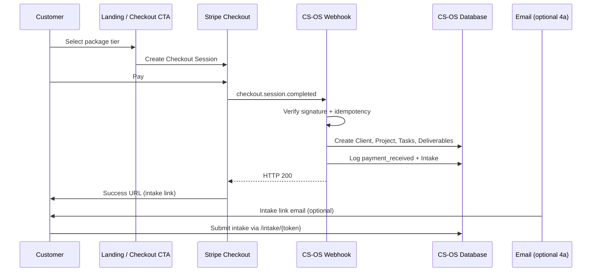

# Phase 4a — Payment Automation Implementation Plan

**Status:** Implementation plan — no code yet  
**Goal:** Customer purchases a package → automatically becomes a CS-OS client at Intake  
**Scope:** Stripe Checkout + webhooks + client provisioning + intake handoff  
**Out of scope (Phase 4b+):** AI generation, deploy automation, client portal beyond intake link

---

## Executive Summary

Phase 4a adds a **payment-first acquisition path** parallel to the existing manual `/intake` flow. A customer completes **Stripe Checkout**, Stripe sends a verified webhook, CS-OS creates a **pending-intake client + project**, and the customer receives a **unique intake link** to submit structured career data.

CS-OS remains the system of record. Stripe is the payment authority. No pipeline stage advance occurs until intake is submitted and validated (Phase 4a handoff only creates the record at **Intake**).

---

## Architecture Overview



---

## 1. Stripe Integration

### 1.1 Recommended API surface

Per Stripe best practices for **one-time package purchases**:

| Decision | Choice | Rationale |
|----------|--------|-----------|
| Payment API | **Checkout Sessions** | Hosted UI, PCI scope reduction, metadata support |
| Not used in 4a | PaymentIntents direct | Unnecessary complexity for tier-based one-time SKUs |
| Not used in 4a | Subscriptions | Packages are one-time in EXECUTION.md |
| API key type | **Restricted API key (RAK)** | Least privilege for Checkout Session create + read |
| Payment methods | **Dynamic** (omit `payment_method_types`) | Dashboard-controlled; maximizes conversion |
| API version | Pin `2026-05-27.dahlia` (or latest at build time) | Consistent webhook payload shape |

### 1.2 Checkout Session design

**One Stripe Price per tier** (created in Dashboard or via API once):

| Tier | Price | Stripe Price ID env var |
|------|-------|-------------------------|
| Basic | $99 | `STRIPE_PRICE_BASIC` |
| Standard | $199 | `STRIPE_PRICE_STANDARD` |
| Premium | $299–399 | `STRIPE_PRICE_PREMIUM` |

**Session creation** (future route: `POST /checkout/create` or external landing):

```text
mode: payment
line_items: [{ price: STRIPE_PRICE_{tier}, quantity: 1 }]
success_url: {BASE_URL}/purchase/success?session_id={CHECKOUT_SESSION_ID}
cancel_url:  {BASE_URL}/purchase/cancelled
customer_email: (optional prefill)
metadata:
  package_tier: Basic | Standard | Premium
  csos_source: stripe_checkout
  utm_source / utm_campaign: (optional, from landing)
client_reference_id: (optional UUID for tracing)
```

**Success page** does not create the client — webhook does. Success page only displays intake link once webhook has processed (poll or session lookup).

### 1.3 Webhook flow

**Endpoint:** `POST /webhooks/stripe`  
**Properties:** Public HTTPS, raw body required for signature verification, no auth middleware (signature is auth).

```text
1. Receive raw request body + Stripe-Signature header
2. Reject if STRIPE_WEBHOOK_SECRET missing (500 — config error, alert operator)
3. stripe.Webhook.construct_event(body, sig, secret)
   → on failure: HTTP 400 (invalid signature — do not process)
4. Lookup event.id in stripe_webhook_events
   → if exists: HTTP 200 (already processed — idempotent)
5. Begin DB transaction
6. Dispatch by event.type (see §1.4)
7. Insert stripe_webhook_events row (event_id, type, processed_at)
8. Commit transaction
9. Return HTTP 200 with empty body
```

**Stripe retry behavior:** Non-2xx responses trigger retries for up to 3 days. Always return **200 after successful processing or confirmed duplicate**. Return **400 only for invalid signature**. Return **500 only for transient DB errors** (Stripe will retry).

### 1.4 Payment events used (Phase 4a)

| Event | Action | Priority |
|-------|--------|----------|
| `checkout.session.completed` | **Primary.** Create client + project if `payment_status=paid` | Required |
| `checkout.session.expired` | Log `payment_expired`; no client created | Optional |
| `payment_intent.payment_failed` | Log failure; link to session if metadata available | Required |
| `charge.refunded` | Set `payment_status=refunded`; block intake; log event | Required |
| `charge.dispute.created` | Set `payment_status=disputed`; alert operator | Optional 4a |

**Not handled in 4a:** `customer.subscription.*`, Connect events, invoice events.

**`checkout.session.completed` preconditions before client creation:**

```text
session.payment_status == "paid"
session.status == "complete"
metadata.package_tier in {Basic, Standard, Premium}
customer_details.email OR customer_email present
```

If preconditions fail → log to `stripe_webhook_events` with `processing_error`; return 200 (do not retry forever on bad data).

### 1.5 Failure handling

| Failure | System response | Customer impact |
|---------|-----------------|-----------------|
| Payment declined | `payment_intent.payment_failed` logged; no client | Stripe Checkout shows error; retry pay |
| Checkout abandoned | `checkout.session.expired` logged | No client; optional recovery email (4b) |
| Webhook signature invalid | HTTP 400 | None — event rejected |
| DB error during create | HTTP 500; Stripe retries | Delayed client creation; idempotency prevents dup |
| Invalid metadata (bad tier) | Log error; HTTP 200 | Manual ops follow-up; no client |
| Refund after client created | `payment_status=refunded`; intake link invalidated | Support contact |
| Success URL hit before webhook | Success page polls session status | "Processing payment…" spinner |

### 1.6 Duplicate payment protection

**Three layers:**

1. **Stripe idempotency:** `stripe_webhook_events.stripe_event_id` UNIQUE — same event never processed twice.
2. **Checkout session uniqueness:** `clients.stripe_checkout_session_id` UNIQUE — one client per paid session.
3. **Payment intent uniqueness:** `clients.stripe_payment_intent_id` UNIQUE (nullable until completed) — backup dedup if session replayed.

**Edge cases:**

| Scenario | Behavior |
|----------|----------|
| Same webhook delivered twice | Second delivery: event_id exists → 200 no-op |
| Customer pays twice (two sessions) | Two clients — correct (two purchases) |
| Webhook retry after partial commit | Transaction wraps all writes; uncommitted retry succeeds once |
| Manual `/intake` + Stripe same email | Allowed — separate records unless business rule added later |

---

## 2. Client Creation (on payment success)

### 2.1 Trigger

`checkout.session.completed` with `payment_status=paid`.

### 2.2 Creation sequence

Reuse existing seeding logic pattern from `create_client_with_project()` but with **payment placeholders** until intake submitted:

```text
1. Extract from session:
   - email (customer_details.email)
   - name (customer_details.name or email local-part)
   - package_tier (metadata.package_tier)
   - stripe_checkout_session_id
   - stripe_payment_intent_id
   - stripe_customer_id (if present)

2. Create Client:
   - name: from Stripe or "Pending — {email}"
   - email: stored (new field)
   - target_role: "Pending intake" (placeholder)
   - experience_summary: empty placeholder block
   - skills: empty or "Pending intake"
   - package_tier: from metadata
   - payment_status: paid
   - intake_status: pending
   - intake_token: generate cryptographically secure token
   - public_id: UUID v4 (client-facing identifier)
   - stripe_* fields populated

3. Create Project:
   - status: Intake (PipelineStatus.INTAKE)
   - payment_gated: true (optional flag)

4. Seed Tasks: default_tasks_for_project() (unchanged)

5. Seed Deliverables: same four defaults (unchanged)

6. TimestampLog entries:
   - entity_type=payment, new_state=payment_received
   - entity_type=project, previous_state=null, new_state=Intake
   - entity_type=client, new_state=client_created_from_stripe

7. Commit transaction

8. Return intake_url: {BASE_URL}/intake/{intake_token}
```

### 2.3 What is NOT created automatically

- No advance to Analysis (intake validation required first)
- No AI content
- No GitHub repo
- No email until optional 4a email step configured

### 2.4 Operator visibility

Dashboard shows paid clients with:

- `[PAID]` or payment badge alongside name
- `intake_status=pending` visible (filter or column — UI in 4a implementation)
- Internal link `/clients/{id}` works immediately for operator

---

## 3. Intake Handoff

### 3.1 Unique intake link

**Format:** `https://{domain}/intake/{intake_token}`

| Property | Specification |
|----------|---------------|
| Token length | 32+ bytes, URL-safe (secrets.token_urlsafe(32)) |
| Storage | `clients.intake_token` UNIQUE, indexed |
| Expiry | 14 days default (configurable `INTAKE_TOKEN_TTL_DAYS`) |
| Invalidation | On intake submit success; on refund; on manual operator reset |
| Rate limit | 10 POST attempts / hour / token (future middleware) |

### 3.2 Client identifier (public)

**Do not expose internal integer `client.id` in customer URLs.**

| Identifier | Use |
|------------|-----|
| `public_id` (UUID) | Customer support references, success page display |
| `intake_token` | Single-use intake URL (secret capability) |
| Internal `id` | Operator dashboard only |

**Success page example:**  
*"Your reference: CSOS-{public_id first 8 chars}. Check your email for the intake form."*

### 3.3 Intake form behavior (public route)

**Route:** `GET/POST /intake/{token}` (new public route — separate from internal `/intake`)

| Check | Fail response |
|-------|---------------|
| Token exists | 404 generic "Link invalid or expired" |
| `intake_status != pending` | 200 "Intake already submitted" |
| `payment_status == paid` | — |
| `payment_status == refunded` | 403 "Payment refunded — contact support" |
| Token expired | 410 Gone |

**POST success:**

- Run existing `intake_validation.py` rules (same as internal form)
- Update client fields (replace placeholders)
- Set `intake_status=complete`, `intake_completed_at=now`
- Clear or hash intake_token (prevent reuse)
- Log `intake_submitted` in TimestampLog
- **Do not auto-advance stage in 4a** unless explicit toggle approved (recommend: operator reviews first paid intake manually)

### 3.4 Status tracking

Customer-facing (success page + optional email):

```text
Payment:   ✓ Received
Intake:    ○ Pending → submit your career details
Delivery:  — Waiting for intake
```

Operator-facing (existing client detail + new fields):

```text
payment_status: paid | refunded | disputed
intake_status:  pending | complete
package_tier:   Basic | Standard | Premium
pipeline:       Intake
```

---

## 4. Security

### 4.1 Webhook signature verification

```text
Required: Stripe-Signature header validation on every webhook request
Library:  stripe.Webhook.construct_event(raw_body, sig_header, webhook_secret)
Never:    Parse JSON before verification
Never:    Use GET webhooks or query-param secrets
```

**Clock skew tolerance:** Stripe SDK default (300s). Reject stale signatures.

### 4.2 Secret management

| Secret | Storage | Notes |
|--------|---------|-------|
| `STRIPE_SECRET_KEY` | Render env / `.env` (never commit) | Restricted key: Checkout Sessions write, read only |
| `STRIPE_WEBHOOK_SECRET` | Render env | Per-endpoint whsec_ value |
| `STRIPE_PRICE_*` | Render env | Price IDs, not secret but env-managed |
| `INTAKE_TOKEN_PEPPER` | Render env (optional) | HMAC pepper if tokens stored hashed |
| `BASE_URL` | Render env | https://production domain |

**Development:** Stripe CLI `stripe listen --forward-to localhost:8000/webhooks/stripe` provides local webhook secret.

**Production checklist:**

- [ ] Separate Stripe live vs test keys
- [ ] Webhook endpoint registered in Stripe Dashboard (live mode)
- [ ] RAK scoped to minimum permissions
- [ ] No secrets in logs or TimestampLog

### 4.3 Data validation

| Input | Validation |
|-------|------------|
| `metadata.package_tier` | Allowlist: Basic, Standard, Premium |
| Email from Stripe | RFC basic format; lowercase normalize |
| Checkout session ID | Must start with `cs_`; store verbatim |
| Intake form POST | Reuse `intake_validation.py` — no bypass for public route |
| Webhook event type | Allowlist dispatch — unknown types → log + 200 |

**Fail closed:** Missing tier metadata → no client created. Unpaid session → no client created.

---

## 5. Database Schema Changes (documentation only)

### 5.1 `clients` table — new columns

| Column | Type | Nullable | Notes |
|--------|------|----------|-------|
| `email` | VARCHAR(320) | NO* | *Required for Stripe-created clients; nullable for legacy manual clients |
| `public_id` | UUID | NO | Unique; default gen on insert |
| `payment_status` | ENUM | YES | `unpaid`, `paid`, `refunded`, `disputed`; NULL for manual clients |
| `intake_status` | ENUM | NO | `pending`, `complete`; default `complete` for manual clients |
| `intake_token` | VARCHAR(128) | YES | Unique; NULL after intake complete |
| `intake_token_expires_at` | TIMESTAMPTZ | YES | |
| `intake_completed_at` | TIMESTAMPTZ | YES | |
| `stripe_checkout_session_id` | VARCHAR(255) | YES | UNIQUE |
| `stripe_payment_intent_id` | VARCHAR(255) | YES | UNIQUE |
| `stripe_customer_id` | VARCHAR(255) | YES | INDEX |

**Relax existing NOT NULL constraints (migration required):**

| Column | Change |
|--------|--------|
| `target_role` | Allow placeholder until intake complete |
| `experience_summary` | Allow placeholder until intake complete |
| `skills` | Allow placeholder until intake complete |

Alternative (not recommended): separate `pending_purchases` table — adds join complexity; single Client row with status flags is simpler for dashboard.

### 5.2 New table: `stripe_webhook_events`

| Column | Type | Notes |
|--------|------|-------|
| `id` | INTEGER PK | |
| `stripe_event_id` | VARCHAR(255) | UNIQUE — idempotency key |
| `event_type` | VARCHAR(100) | e.g. checkout.session.completed |
| `stripe_checkout_session_id` | VARCHAR(255) | Nullable; INDEX |
| `processing_status` | ENUM | `processed`, `ignored`, `error` |
| `processing_error` | TEXT | Nullable |
| `payload_summary` | JSON/TEXT | Nullable; no full PAN/card data |
| `created_at` | TIMESTAMPTZ | |

### 5.3 `timestamp_logs` — new entity types (no schema change)

Use existing `entity_type` string field:

- `payment`
- `client`
- (existing) `project`, `task`, `deliverable`

### 5.4 Indexes

```text
UNIQUE clients.stripe_checkout_session_id
UNIQUE clients.stripe_payment_intent_id
UNIQUE clients.intake_token
UNIQUE clients.public_id
INDEX  clients.email
INDEX  clients.payment_status
INDEX  clients.intake_status
UNIQUE stripe_webhook_events.stripe_event_id
```

### 5.5 Migration notes

- SQLite (dev) → add columns via existing `migrations.py` pattern
- Production target: PostgreSQL before multi-worker webhook handling (per AUTOMATION_ARCHITECTURE.md)
- Backfill: existing manual clients get `intake_status=complete`, `payment_status=NULL`

---

## 6. Testing Plan

### 6.1 Test environment

| Tool | Purpose |
|------|---------|
| Stripe Test Mode | No real money |
| Stripe CLI | Forward webhooks locally; trigger fixtures |
| Test card `4242...` | Successful payment |
| Test card `4000...0002` | Declined payment |

### 6.2 Test cases

#### TC-01: Successful payment

```text
Given:  Stripe test Checkout Session for Standard tier
When:   Customer completes payment with 4242 card
Then:   checkout.session.completed webhook fires
        Client created with payment_status=paid, intake_status=pending
        Project at Intake with tasks + deliverables seeded
        TimestampLog: payment_received, Intake
        intake_token generated; link returns 200 on GET
        stripe_webhook_events row: processed
        HTTP 200 returned to Stripe
```

#### TC-02: Failed payment

```text
Given:  Checkout Session started
When:   Customer uses declined card 4000000000000002
Then:   No client created
        payment_intent.payment_failed logged in stripe_webhook_events
        No intake_token exists for session
```

#### TC-03: Duplicate webhook delivery

```text
Given:  TC-01 completed successfully
When:   Same checkout.session.completed event replayed (same event.id)
Then:   HTTP 200
        No second client created
        stripe_webhook_events: single row for event.id
        Idempotency confirmed via session_id uniqueness
```

#### TC-04: Invalid webhook

```text
Given:  POST /webhooks/stripe with tampered body or wrong signature
When:   Request processed
Then:   HTTP 400
        No DB writes
        No client created

Given:  Valid signature but unknown event.type (e.g. customer.created)
When:   Request processed
Then:   HTTP 200
        Event logged as ignored
        No client created
```

#### TC-05: Refund after creation (regression)

```text
Given:  TC-01 client exists
When:   charge.refunded webhook fires
Then:   payment_status=refunded
        intake link returns 403
        TimestampLog: payment_refunded
        Project remains at Intake (no delete)
```

#### TC-06: Intake handoff completion

```text
Given:  TC-01 client with pending intake
When:   Customer submits valid intake form via /intake/{token}
Then:   Placeholder fields replaced with validated data
        intake_status=complete
        intake_token cleared/expired
        Second POST returns "already submitted"
```

#### TC-07: Success page race

```text
Given:  Customer lands on success URL before webhook completes
When:   Success page polls GET /api/purchase/status?session_id=cs_...
Then:   Returns pending → complete within retry window
        Displays intake link once client exists
```

### 6.3 Manual QA checklist (pre-production)

```text
[ ] Live webhook endpoint reachable from Stripe
[ ] Test mode and live mode keys isolated
[ ] Refund flow tested in test mode
[ ] Operator dashboard shows paid pending-intake clients
[ ] Manual /intake flow still works unchanged
[ ] Demo clients unaffected
[ ] No card numbers in logs or DB
```

---

## 7. Implementation Sequence (when coding begins)

| Step | Deliverable | Depends on |
|------|-------------|------------|
| 1 | DB migration (§5) | — |
| 2 | Stripe env config + Price IDs | Stripe Dashboard |
| 3 | `POST /checkout/create` (session factory) | Step 1–2 |
| 4 | `POST /webhooks/stripe` + idempotency | Step 1 |
| 5 | `create_client_from_payment()` service | Step 4 |
| 6 | `GET/POST /intake/{token}` public route | Step 5 |
| 7 | Success / cancel pages | Step 4–5 |
| 8 | Dashboard payment/intake indicators | Step 5 |
| 9 | Test suite TC-01 through TC-07 | All |

**Estimated touch points (no code now):**

- `app/models.py` — new fields + StripeWebhookEvent model
- `app/migrations.py` — column adds
- `app/services.py` — `create_client_from_payment()`
- `app/main.py` — webhook + checkout + public intake routes
- `app/templates/` — success page, public intake variant
- `requirements.txt` — `stripe` SDK
- `.env.example` — documented secrets

---

## 8. Unchanged in Phase 4a

- Pipeline rules (`can_transition`, Option B rollback)
- Internal operator `/intake` and `/clients/{id}` flows
- Task/deliverable seeding logic
- Demo seed system
- Auth (still single-user operator; intake token is customer-scoped capability)

---

## 9. Open Decisions (resolve before coding)

| # | Question | Recommendation |
|---|----------|----------------|
| 1 | Auto-advance to Analysis after intake submit? | **No** in 4a — operator confirms first paid clients |
| 2 | Send intake email in 4a? | **Yes** if Resend key available; else success page only |
| 3 | Premium price fixed or range? | Single Price at $349; custom quotes stay manual |
| 4 | Postgres migration in 4a or 4b? | **4a if deploying webhooks to Render**; SQLite OK for local dev only |

---

## Related Documents

- [AUTOMATION_ARCHITECTURE.md](./AUTOMATION_ARCHITECTURE.md) — Full pipeline blueprint
- [EXECUTION.md](../EXECUTION.md) — Offer tiers and delivery model
- [DEMO_WALKTHROUGH.md](./DEMO_WALKTHROUGH.md) — Sales journey (manual demo path unchanged)

---

## Document Control

| Field | Value |
|-------|-------|
| Version | 1.0 |
| Phase | 4a — Payment Automation |
| Code impact | None until approved |
