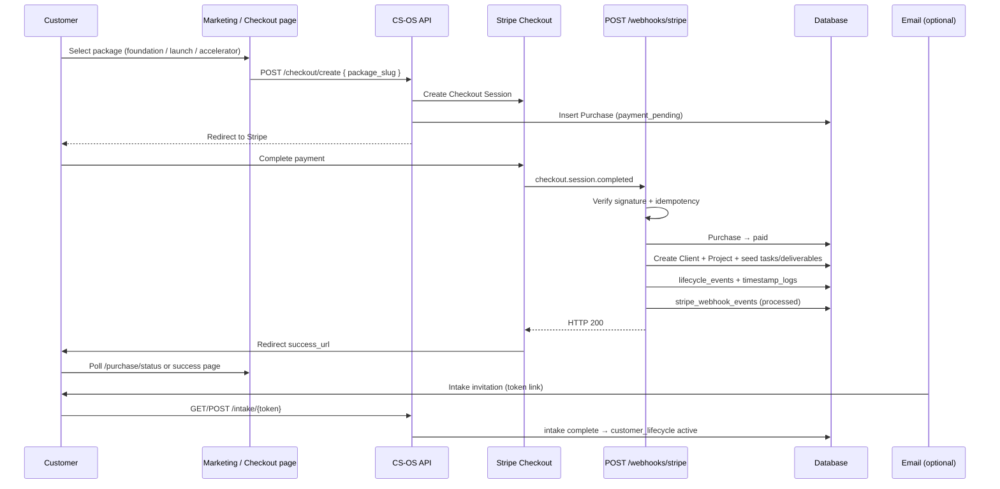

# Phase 4A — Stripe Revenue Infrastructure Implementation Plan

**Project:** CS-OS Revenue Infrastructure Phase 4A  
**Mode:** Planning only — no code changes  
**Goal:** Customer selects a package, pays via Stripe, and automatically becomes a CS-OS client with intake invitation  
**Constraint:** Existing delivery pipeline and workflow rules remain unchanged

---

## Document Alignment

This plan consolidates and supersedes package naming in [PHASE_4A_PAYMENT_PLAN.md](./PHASE_4A_PAYMENT_PLAN.md) where older tiers (Basic / Standard / Premium) appear. **Canonical package identifiers:** `foundation`, `launch`, `accelerator`.

| Source document | Role in Phase 4A |
|-----------------|------------------|
| [PRICING_MODEL.md](./PRICING_MODEL.md) | Package scope, prices, Stripe Price env vars |
| [PAID_CLIENT_OPERATIONS.md](./PAID_CLIENT_OPERATIONS.md) | Customer + purchase lifecycles, SLA, fulfillment gating |
| [CUSTOMER_TERMS.md](./CUSTOMER_TERMS.md) | Customer-facing refund, intake deadline, acceptance |
| [AUTOMATION_ARCHITECTURE.md](./AUTOMATION_ARCHITECTURE.md) | Phase 4A scope within full automation roadmap |
| [packages.config.example.yaml](./packages.config.example.yaml) | Machine-readable package + Stripe mapping |

---

## Architecture Summary

Phase 4A adds a **revenue layer** parallel to the existing manual `/intake` operator flow. Stripe is the payment authority. CS-OS remains the system of record for clients, projects, and pipeline state.

**Two lifecycles (orthogonal to delivery pipeline):**

| Lifecycle | States | Owned by |
|-----------|--------|----------|
| **Purchase** | created → payment_pending → paid \| failed \| refunded | `purchases` table |
| **Customer (commercial)** | purchased → intake_pending → active → delivered → archived | `clients.customer_lifecycle` |

**Delivery pipeline (unchanged):** Intake → Analysis → Build → QA → Review → Delivered

Phase 4A creates clients at pipeline **Intake** with `customer_lifecycle = intake_pending`. Pipeline does not advance until validated intake is submitted.

---

## End-to-End Stripe Flow



### Step-by-step

| Step | Actor | Action |
|------|-------|--------|
| 1 | Customer | Visits checkout entry (landing or `/checkout/{package_slug}`) |
| 2 | CS-OS | Creates Stripe Checkout Session with `metadata.package_slug` |
| 3 | CS-OS | Inserts `purchases` row: `payment_pending`, links `stripe_checkout_session_id` |
| 4 | Customer | Pays on Stripe-hosted Checkout |
| 5 | Stripe | Sends `checkout.session.completed` to webhook |
| 6 | CS-OS | Verifies signature; checks idempotency; begins transaction |
| 7 | CS-OS | Updates `purchases.status = paid`; creates `clients` + `projects` |
| 8 | CS-OS | Seeds package-scoped tasks/deliverables (per [PRICING_MODEL.md](./PRICING_MODEL.md)) |
| 9 | CS-OS | Sets `customer_lifecycle = intake_pending`; generates intake token |
| 10 | CS-OS | Logs `lifecycle_events` + `timestamp_logs`; returns HTTP 200 |
| 11 | Customer | Lands on success page; receives intake URL (page + optional email) |
| 12 | Customer | Submits structured intake → `intake_pending → active` |

**Critical rule:** Success URL redirect does **not** create the client. Webhook does. Success page polls until purchase is `paid` and client exists.

---

## 1. Database Changes

### 1.1 New table: `purchases`

Payment transaction record. Created at checkout session creation; finalized on webhook.

| Column | Type | Constraints | Notes |
|--------|------|-------------|-------|
| `id` | INTEGER | PK | |
| `public_id` | UUID | UNIQUE, NOT NULL | Customer-facing order reference |
| `package_slug` | VARCHAR(50) | NOT NULL | `foundation` \| `launch` \| `accelerator` |
| `status` | ENUM | NOT NULL | See §2 purchase lifecycle |
| `amount_cents` | INTEGER | NOT NULL | Snapshot at checkout |
| `currency` | CHAR(3) | NOT NULL, default `USD` | |
| `stripe_checkout_session_id` | VARCHAR(255) | UNIQUE | Set at session create |
| `stripe_payment_intent_id` | VARCHAR(255) | UNIQUE, NULL | Set on completion |
| `stripe_customer_id` | VARCHAR(255) | NULL, INDEX | |
| `customer_email` | VARCHAR(320) | NULL | From Stripe session |
| `client_id` | INTEGER | FK → clients, NULL | Set when client provisioned |
| `paid_at` | TIMESTAMPTZ | NULL | |
| `failed_at` | TIMESTAMPTZ | NULL | |
| `refunded_at` | TIMESTAMPTZ | NULL | |
| `created_at` | TIMESTAMPTZ | NOT NULL | |
| `updated_at` | TIMESTAMPTZ | NOT NULL | |

**Indexes:** `status`, `package_slug`, `client_id`, `customer_email`

---

### 1.2 New table: `stripe_webhook_events`

Idempotency and audit. One row per Stripe `event.id` processed or ignored.

| Column | Type | Constraints | Notes |
|--------|------|-------------|-------|
| `id` | INTEGER | PK | |
| `stripe_event_id` | VARCHAR(255) | UNIQUE, NOT NULL | Idempotency key |
| `event_type` | VARCHAR(100) | NOT NULL | e.g. `checkout.session.completed` |
| `purchase_id` | INTEGER | FK → purchases, NULL | |
| `stripe_checkout_session_id` | VARCHAR(255) | NULL, INDEX | |
| `processing_status` | ENUM | NOT NULL | `processed`, `ignored`, `error` |
| `processing_error` | TEXT | NULL | No card data |
| `created_at` | TIMESTAMPTZ | NOT NULL | |

---

### 1.3 New table: `lifecycle_events` (recommended P1)

Commercial lifecycle audit trail (parallel to `timestamp_logs` for pipeline).

| Column | Type | Notes |
|--------|------|-------|
| `id` | PK | |
| `client_id` | FK → clients | INDEX |
| `previous_state` | VARCHAR(50) | NULL |
| `new_state` | VARCHAR(50) | |
| `trigger` | VARCHAR(100) | `stripe_webhook`, `intake_submit`, `refund`, etc. |
| `purchase_id` | FK, NULL | |
| `created_at` | TIMESTAMPTZ | |

---

### 1.4 Extensions to `clients`

| Column | Type | Notes |
|--------|------|-------|
| `public_id` | UUID | UNIQUE; customer-facing ID |
| `email` | VARCHAR(320) | INDEX; from Stripe |
| `package_slug` | VARCHAR(50) | **Canonical package** — replaces legacy `package_tier` for new records |
| `package_tier` | VARCHAR(50) | Retained for display/backfill (`Foundation`, `Launch`, `Accelerator`) |
| `customer_lifecycle` | ENUM | `intake_pending`, `active`, `delivered`, `archived` (+ NULL for legacy manual) |
| `purchase_id` | FK → purchases | NULL for manual clients |
| `intake_status` | ENUM | `pending`, `complete` |
| `intake_token_hash` | VARCHAR(128) | UNIQUE; store hash only |
| `intake_token_expires_at` | TIMESTAMPTZ | Default 14 days from payment |
| `intake_completed_at` | TIMESTAMPTZ | NULL |
| `paid_at` | TIMESTAMPTZ | Denormalized from purchase |
| `archived_at` | TIMESTAMPTZ | NULL |

**Placeholder fields until intake complete:** `target_role`, `experience_summary`, `skills` may hold `"Pending intake"` or become nullable via migration.

---

### 1.5 `package_slug` handling

| Rule | Specification |
|------|---------------|
| **Source of truth at checkout** | Stripe Session `metadata.package_slug` |
| **Allowed values** | `foundation`, `launch`, `accelerator` only |
| **Validation** | Reject webhook if slug missing or not in allowlist |
| **Storage** | `purchases.package_slug` + `clients.package_slug` |
| **Display name** | Derived from [packages.config.example.yaml](./packages.config.example.yaml) or static map |
| **Legacy mapping** | `Basic→foundation`, `Standard→launch`, `Premium→accelerator` for existing rows |
| **Fulfillment gating** | Seed deliverables/tasks per slug (Phase 4A may seed all four deliverables; gating in 4A.1) |
| **Stripe Price mapping** | Env vars: `STRIPE_PRICE_FOUNDATION`, `STRIPE_PRICE_LAUNCH`, `STRIPE_PRICE_ACCELERATOR` |

```text
checkout/create receives package_slug
  → validate allowlist
  → resolve STRIPE_PRICE_{SLUG} env
  → metadata.package_slug = slug on Session
  → purchases.package_slug = slug
```

---

### 1.6 Migration & backfill

| Existing data | Backfill |
|---------------|----------|
| Manual clients | `customer_lifecycle = active`, `intake_status = complete`, `purchase_id = NULL` |
| `[DEMO]` clients | Unchanged |
| `package_tier` Basic/Standard/Premium | Map to slug + display name |

**Production note:** PostgreSQL recommended before webhook deployment ([AUTOMATION_ARCHITECTURE.md](./AUTOMATION_ARCHITECTURE.md)). SQLite acceptable for local dev only.

---

## 2. Purchase Lifecycle

```text
created → payment_pending → paid | failed | refunded
```

| Status | When set |
|--------|----------|
| `created` | Optional transient; may merge with `payment_pending` |
| `payment_pending` | Checkout Session created; customer on Stripe |
| `paid` | `checkout.session.completed` + `payment_status=paid` |
| `failed` | `payment_intent.payment_failed` or session expired |
| `refunded` | `charge.refunded` webhook |

**Customer lifecycle mapping on `paid`:**

```text
purchases.paid → clients created → customer_lifecycle = intake_pending
intake submitted  → customer_lifecycle = active
pipeline Delivered + ops sign-off → customer_lifecycle = delivered
```

---

## 3. Failure Handling

### 3.1 Duplicate webhook events

| Scenario | Behavior |
|----------|----------|
| Same `event.id` delivered twice | Lookup `stripe_webhook_events.stripe_event_id`; if exists → **HTTP 200**, no-op |
| Retry after successful commit | Idempotent; no duplicate client |
| Retry after failed commit (before commit) | Transaction rolls back; retry succeeds once |
| Same session, different event types | Each event.id stored separately |

**Additional constraint:** `purchases.stripe_checkout_session_id` UNIQUE — one purchase per session.

---

### 3.2 Failed payments

| Event | CS-OS action | Customer state |
|-------|--------------|----------------|
| `payment_intent.payment_failed` | Log in `stripe_webhook_events`; set `purchases.status = failed` if session linked | No client created |
| Card declined on Checkout | Stripe UI handles retry | No CS-OS record beyond `payment_pending` purchase |

**HTTP response:** 200 after logging (no client provisioning).

---

### 3.3 Abandoned checkout

| Event | CS-OS action |
|-------|--------------|
| `checkout.session.expired` | `purchases.status = failed` or dedicated `expired`; log event |
| Customer never returns | Purchase remains `payment_pending` until expiry webhook |

**Optional Phase 4A.1:** Recovery email via Stripe + operator dashboard filter on stale `payment_pending`.

---

### 3.4 Refund handling

| Event | CS-OS action |
|-------|--------------|
| `charge.refunded` | `purchases.status = refunded`, `refunded_at` set |
| Client exists | `customer_lifecycle → archived` (or hold state); invalidate intake token |
| Pipeline | **Do not delete** project; block further stage changes if refunded |
| Logs | `lifecycle_events`: `refund`; `timestamp_logs`: payment entity |

Aligns with [CUSTOMER_TERMS.md](./CUSTOMER_TERMS.md) §6.

---

### 3.5 Customer pays but does not complete intake

| Timeline | Action |
|----------|--------|
| Payment success | Client created; `intake_pending`; intake link issued |
| +24h / +72h / day 7 | Automated reminder email (optional 4A.1) |
| Day 14 no intake | Operator alert; per CUSTOMER_TERMS: contact + optional partial refund |
| Intake token expired | `intake_status` remains pending; operator reissues token |
| Refund before intake | Full refund minus processing fees (operator-initiated via Stripe) |

**SLA delivery clock does not start until intake complete** ([PAID_CLIENT_OPERATIONS.md](./PAID_CLIENT_OPERATIONS.md) §3.1).

**Dashboard (future):** Filter `customer_lifecycle = intake_pending` + `paid_at` age.

---

## 4. Security Requirements

### 4.1 Webhook signature verification

| Requirement | Implementation |
|-------------|----------------|
| Verify every request | `Stripe-Signature` header + `STRIPE_WEBHOOK_SECRET` |
| Raw body | Parse JSON **only after** `stripe.Webhook.construct_event()` |
| Invalid signature | **HTTP 400**; no DB writes |
| Missing secret (misconfig) | **HTTP 500**; alert operator |
| Clock skew | Stripe SDK default tolerance |

### 4.2 Secret handling

| Secret | Storage | Never |
|--------|---------|-------|
| `STRIPE_SECRET_KEY` | Render env / `.env` | Commit, logs, TimestampLog |
| `STRIPE_WEBHOOK_SECRET` | Render env | Client-side, success page |
| `STRIPE_PRICE_*` | Env | Hardcode in application |
| `INTAKE_TOKEN_PEPPER` | Env (optional) | Store plaintext tokens in DB |

Use **Restricted API Key** scoped to Checkout Session create/read ([Stripe best practices](https://docs.stripe.com/keys)).

Separate **test** vs **live** keys and webhook endpoints.

### 4.3 Idempotency

| Layer | Key |
|-------|-----|
| Webhook events | `stripe_event_id` UNIQUE |
| Purchases | `stripe_checkout_session_id` UNIQUE |
| Payment intents | `stripe_payment_intent_id` UNIQUE |
| Intake tokens | Single active token per client; hash at rest |

All provisioning in **one DB transaction**; rollback on any failure before HTTP 200.

### 4.4 Data validation

| Input | Rule |
|-------|------|
| `metadata.package_slug` | Allowlist: foundation, launch, accelerator |
| `session.payment_status` | Must be `paid` before client create |
| Email | Normalize lowercase; required from Stripe |
| Intake POST | Reuse existing `intake_validation.py`; no bypass |

---

## 5. Testing Requirements

### 5.1 Test environment

- Stripe **Test Mode**
- Stripe CLI: `stripe listen --forward-to localhost:8000/webhooks/stripe`
- Cards: `4242…` (success), `4000…0002` (decline)

### 5.2 Required test cases

#### TC-01: Successful payment

```text
Given:  Checkout for package_slug=launch
When:   Customer pays with 4242
Then:   purchases.status = paid
        Client + Project created
        customer_lifecycle = intake_pending
        package_slug = launch on purchase and client
        intake token valid on GET /intake/{token}
        stripe_webhook_events.processed
        HTTP 200 to Stripe
        lifecycle_events + timestamp_logs written
```

#### TC-02: Failed payment

```text
Given:  Checkout session open
When:   Declined card 4000000000000002
Then:   No client created
        purchases.status = failed (or remains payment_pending until expiry)
        payment_intent.payment_failed logged
```

#### TC-03: Duplicate webhook

```text
Given:  TC-01 completed
When:   Same checkout.session.completed event.id replayed
Then:   HTTP 200
        Exactly one client for session_id
        One stripe_webhook_events row for event.id
```

#### TC-04: Refund

```text
Given:  TC-01 client exists
When:   charge.refunded webhook fires
Then:   purchases.status = refunded
        Intake link invalid (403)
        customer_lifecycle archived or refund-hold state
        No duplicate side effects on replay
```

#### TC-05: Incomplete intake

```text
Given:  TC-01 client; intake_pending
When:   14 days pass without intake (simulate via DB or clock)
Then:   Operator dashboard surfaces stale intake_pending
        Token expiry enforced on POST
When:   Customer completes intake before expiry
Then:   customer_lifecycle = active
        intake_status = complete
        Placeholder fields replaced
        Pipeline remains at Intake until operator advances
```

#### TC-06: Invalid webhook

```text
Given:  Tampered body or bad signature
When:   POST /webhooks/stripe
Then:   HTTP 400
        Zero DB writes
```

#### TC-07: Success page race

```text
Given:  Customer hits success_url before webhook completes
When:   GET /purchase/status?session_id=cs_...
Then:   pending → complete when purchase paid + client exists
        Intake URL displayed only after provisioned
```

---

## 6. Acceptance Criteria (Phase 4A Complete)

Phase 4A is **complete** when all criteria pass in **Stripe Test Mode** and one **manual smoke test** in production (optional small charge + refund):

### Revenue path

- [ ] Customer can start checkout for each package slug (foundation, launch, accelerator)
- [ ] Successful payment creates exactly one `purchases` row and one `clients` row
- [ ] `package_slug` stored correctly on purchase and client
- [ ] Client provisioned at pipeline **Intake** with package-appropriate seed data
- [ ] `customer_lifecycle = intake_pending` after payment

### Intake handoff

- [ ] Customer receives working intake link (success page + optional email)
- [ ] Valid intake submission transitions to `intake_pending → active`
- [ ] Invalid intake returns **422** without corrupting payment record
- [ ] Refunded purchase blocks intake submission

### Reliability

- [ ] Duplicate webhooks are idempotent (TC-03)
- [ ] Failed payments do not create clients (TC-02)
- [ ] Invalid webhooks rejected with 400 (TC-06)
- [ ] DB transaction failure retries safely via Stripe

### Security

- [ ] Webhook signature verified on every request
- [ ] No secrets in repository or logs
- [ ] Intake tokens hashed at rest; not guessable

### Operations

- [ ] Operator dashboard shows paid + intake_pending clients (manual query or filter acceptable in 4A)
- [ ] Manual `/intake` flow still works unchanged for non-Stripe clients
- [ ] Demo clients unaffected
- [ ] Existing pipeline `can_transition` rules unchanged

### Documentation & compliance

- [ ] Checkout displays link to [CUSTOMER_TERMS.md](./CUSTOMER_TERMS.md)
- [ ] Customer confirms agreement at purchase (checkbox)
- [ ] Support email and business info filled in CUSTOMER_TERMS before live

---

## 7. Out of Scope (Phase 4A)

| Item | Phase |
|------|-------|
| AI content generation | 4b |
| GitHub deploy automation | 4c |
| Automated QA | 4d |
| Full client portal | 4e |
| Package deliverable gating (exclude resume on foundation) | 4A.1 |
| Postgres migration | Required before production webhooks; optional for local dev |
| Subscriptions / installments | Not planned |
| Multi-user auth | Not planned |

---

## 8. Implementation Sequence (reference — do not execute in planning mode)

| Order | Deliverable |
|-------|-------------|
| 1 | DB migrations (§1) |
| 2 | Stripe Dashboard: Products + Prices for three slugs |
| 3 | `POST /checkout/create` |
| 4 | `POST /webhooks/stripe` + provisioning service |
| 5 | `GET/POST /intake/{token}` |
| 6 | Success / cancel pages + status poll |
| 7 | Operator visibility for intake_pending |
| 8 | Test cases TC-01 through TC-07 |

---

## Related Documents

- [PHASE_4A_PAYMENT_PLAN.md](./PHASE_4A_PAYMENT_PLAN.md) — Detailed webhook + intake spec (legacy tier names)
- [PRICING_MODEL.md](./PRICING_MODEL.md)
- [PAID_CLIENT_OPERATIONS.md](./PAID_CLIENT_OPERATIONS.md)
- [CUSTOMER_TERMS.md](./CUSTOMER_TERMS.md)
- [AUTOMATION_ARCHITECTURE.md](./AUTOMATION_ARCHITECTURE.md)

---

## Document Control

| Field | Value |
|-------|-------|
| Version | 1.0 |
| Type | Architecture + acceptance criteria |
| Code impact | None until approved for implementation |
